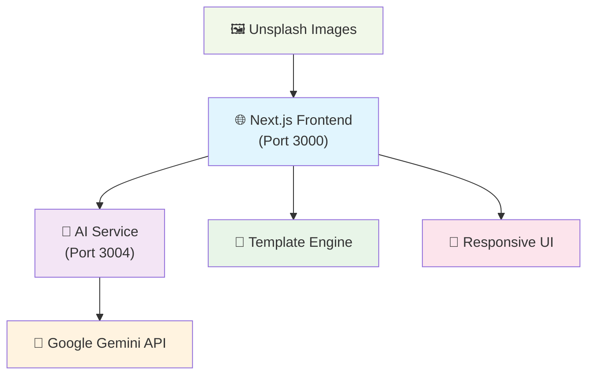

# 🎨 AI-Powered Flyer Maker

<div align="center">
  
</div>

> **Transform your ideas into stunning flyers with the power of AI** ✨

A modern, AI-driven flyer creation platform that combines the intelligence of Google Gemini with beautiful, professional design templates. Create compelling marketing materials in minutes, not hours.

[](https://nextjs.org/)
[](https://reactjs.org/)
[](https://nodejs.org/)
[](https://ai.google.dev/)
[](https://tailwindcss.com/)

## 🚀 Key Features

### 🧠 **AI-Powered Content Generation**
- **Smart Content Creation**: Transform simple descriptions into professional flyer content
- **Google Gemini Integration**: Powered by advanced AI for natural, engaging copy
- **Category-Specific Optimization**: Tailored content for Real Estate, Events, and Business
- **Intelligent Content Mapping**: AI automatically populates appropriate template sections

### 🎨 **Professional Design System**
- **Beautiful Templates**: Carefully crafted designs with modern aesthetics
- **High-Quality Visuals**: Stunning Unsplash images relevant to each category
- **Dynamic Theming**: Category-based color schemes and styling
- **Responsive Design**: Perfect on desktop, tablet, and mobile devices

### ✏️ **Intuitive Editing Experience**
- **Real-Time Preview**: See changes instantly as you edit
- **Smart Text Editor**: Click any element to modify content
- **Typography Controls**: Adjust font sizes with precision sliders
- **Visual Feedback**: Professional selection indicators and hover effects

### 🎯 **Modern UI/UX**
- **SaaS-Grade Interface**: Clean, professional, and user-friendly
- **Gradient Backgrounds**: Beautiful visual depth with subtle animations
- **Component-Based Design**: Consistent styling across the entire platform
- **Smooth Interactions**: Polished hover effects and transitions

## 📸 Screenshots

<div align="center">
  
  
</div>

<div align="center">
  <p><em>Template Selection & AI-Powered Content Generation</em></p>
</div>

## 🛠️ Tech Stack

### **Frontend**
- **Next.js 15.2.4** - React framework with App Router
- **React 19.0.0** - Latest React with concurrent features
- **Tailwind CSS 4** - Utility-first CSS framework
- **Radix UI** - Accessible component primitives
- **Lucide React** - Beautiful SVG icons
- **Zustand** - Lightweight state management
- **Axios** - HTTP client for API requests

### **Backend**
- **Node.js** - JavaScript runtime
- **Express.js** - Web application framework
- **Google Gemini AI** - Advanced language model
- **CORS** - Cross-origin resource sharing
- **dotenv** - Environment variables management

### **Development Tools**
- **Turbopack** - Next.js bundler for faster development
- **Nodemon** - Auto-restart development server
- **ESLint** - Code linting and formatting

## 🏗️ Architecture Overview



### **Component Architecture**

```
📁 client/src/
├── 📁 app/
│   ├── 🏠 page.js (Enhanced Homepage)
│   ├── 📁 flyer-generator/
│   │   └── 🎯 page.js (Main AI Generator)
│   └── 📁 editor/
│       └── ✏️ page.js (Flyer Editor)
├── 📁 components/
│   ├── 📁 flyer/
│   │   ├── 🎨 flyer-editor.js
│   │   ├── 🖼️ template-selector.js
│   │   └── 🤖 ai-generator.js
│   └── 📁 ui/ (Reusable Components)
└── 📁 lib/
    └── 🔧 utils.js
```

## ⚡ Quick Setup

### 1. Backend (AI Service)

```bash
# Navigate to AI service
cd server/flyer-ai-service

# Install dependencies (already done if following along)
npm install

# Configure environment
# Edit .env file and add your Gemini API key:
# GEMINI_API_KEY=your_actual_gemini_api_key_here

# Start the AI service
npm run dev
```

The AI service will run on `http://localhost:3004`

### 2. Frontend

```bash
# Navigate to client
cd client

# Install dependencies (if not already done)
npm install

# Start the frontend
npm run dev
```

The frontend will run on `http://localhost:3000`

## Getting a Gemini API Key

1. Go to [Google AI Studio](https://aistudio.google.com/)
2. Sign in with your Google account
3. Click "Get API Key"
4. Create a new API key
5. Copy the key and add it to `server/flyer-ai-service/.env`

## Usage Workflow

### Step 1: Access AI Flyer Generator

- Open the frontend at `http://localhost:3000`
- Click "Try AI Flyer Generator" on the homepage
- You'll see the new AI-powered flyer generator interface

### Step 2: Select Template

- Choose from available templates:
  - **Modern Real Estate** - Clean design for property listings
  - **Luxury Real Estate** - Elegant design for high-end properties
  - **Modern Event** - Vibrant design for events and gatherings
  - **Professional Business** - Clean design for business promotions

### Step 3: AI Content Generation

- Enter basic information (example for real estate):
  ```
  Beautiful large 3 bedroom, and swimming pool, 3400 sq ft, home for sale at Albany 12034
  ```
- Click "Generate Flyer with AI"
- The AI will create professional content including:
  - Compelling headlines
  - Property highlights in bullet points
  - Location benefits
  - Strong call-to-action

### Step 4: Simple Editing

- Click on any text element in the preview to edit it
- Modify the text content as needed
- Adjust font sizes using the slider
- Save your changes

### Example AI Transformation

**Input:**

```
Beautiful large 3 bedroom, and swimming pool, 3400 sq ft, home for sale at Albany 12034
```

**AI Output:**

```
Beautiful 3-Bedroom Home with Swimming Pool – For Sale in Albany, NY 12034

Property Highlights:
• Spacious 3,400 sq. ft. of living space
• 3 Large Bedrooms designed for comfort
• Sparkling private swimming pool
• Modern kitchen with premium finishes
• Open floor plan with abundant natural light
• Beautifully landscaped yard, perfect for gatherings

Prime Location in Albany 12034 – Close to schools, shopping, and major highways.

Your Dream Home Awaits!
Don't miss this rare opportunity to own a stunning, move-in-ready property.
Call today to schedule a private showing!
```

## API Endpoints

The new AI service provides these endpoints:

- `GET /api/flyer/templates` - Get available templates
- `POST /api/flyer/generate` - Generate AI content only
- `POST /api/flyer/create` - Generate complete flyer with template

## Project Structure

```
flyer-maker/
├── client/                          # Next.js frontend
│   ├── src/app/flyer-generator/     # New AI flyer generator page
│   └── src/components/flyer/        # New flyer components
├── server/
│   ├── flyer-ai-service/            # New AI service
│   │   ├── src/controllers/
│   │   ├── src/routes/
│   │   └── src/config/
│   ├── api-gateway/                 # Existing services
│   ├── design-service/
│   ├── subscription-service/
│   └── upload-service/
└── SETUP_GUIDE.md
```

## Limitations of This Simplified Version

1. **Text Only**: No image editing or graphics capabilities
2. **No Positioning**: Cannot move text elements around
3. **Basic Export**: Only text export, no PDF/image generation
4. **Simple Templates**: Limited template customization
5. **No User Authentication**: Removed login requirements for simplicity

## Extending the Application

To add more features:

1. **Enhanced Templates**: Add more template designs in `server/flyer-ai-service/src/config/flyer-templates.js`
2. **Better Export**: Integrate PDF generation or image export
3. **More AI Features**: Add image generation using AI
4. **Template Customization**: Allow users to modify template layouts
5. **User Accounts**: Re-integrate with the existing authentication system

## Troubleshooting

### Common Issues:

1. **AI Service Not Starting**:

   - Check if Gemini API key is correctly set in `.env`
   - Ensure port 3004 is not in use

2. **Template Not Loading**:

   - Verify AI service is running on port 3004
   - Check browser console for CORS errors

3. **AI Generation Fails**:
   - Verify API key is valid and has credits
   - Check service logs for error details

### Testing the API Directly:

```bash
# Test templates endpoint
curl http://localhost:3004/api/flyer/templates

# Test AI generation
curl -X POST http://localhost:3004/api/flyer/generate \
  -H "Content-Type: application/json" \
  -d '{"userInput":"Beautiful 3 bedroom home for sale","flyerType":"real-estate"}'
```

## Creative Enhancements Applied

1. **AI-First Approach**: Made AI content generation the core feature
2. **Simplified UX**: Reduced complexity to focus on the AI workflow
3. **Template-Driven**: Pre-designed templates for common use cases
4. **Progressive Enhancement**: 3-step process guides users naturally
5. **Smart Content Mapping**: AI content automatically populates appropriate template sections

This simplified version demonstrates the power of AI in content creation while maintaining an intuitive user experience.
